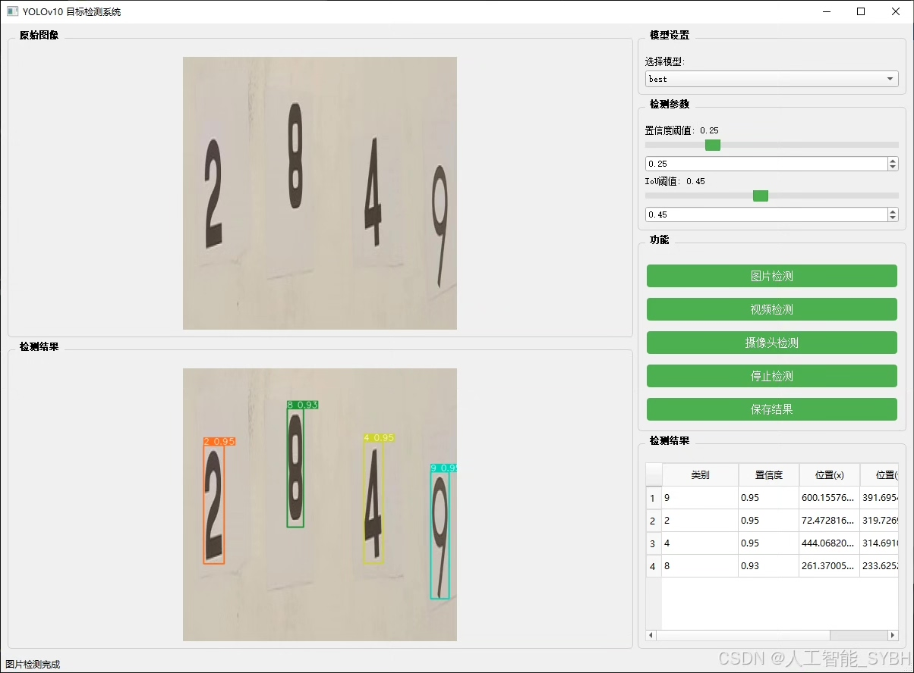
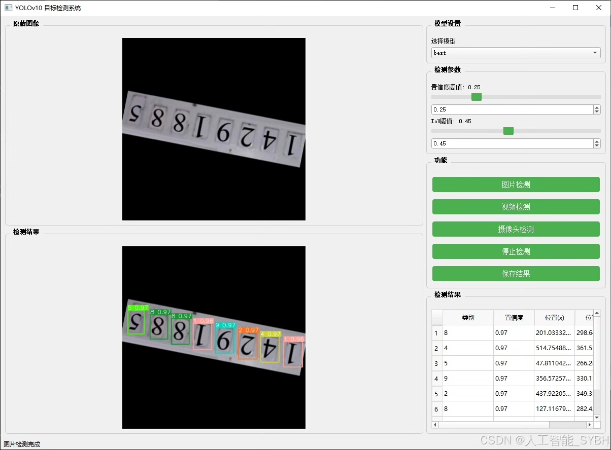
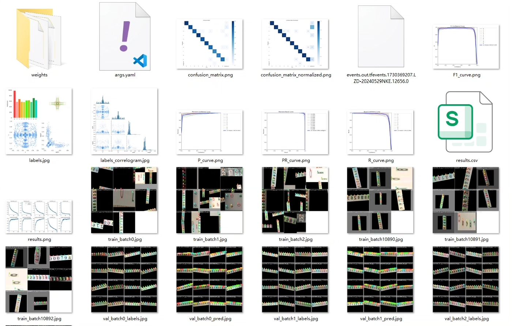
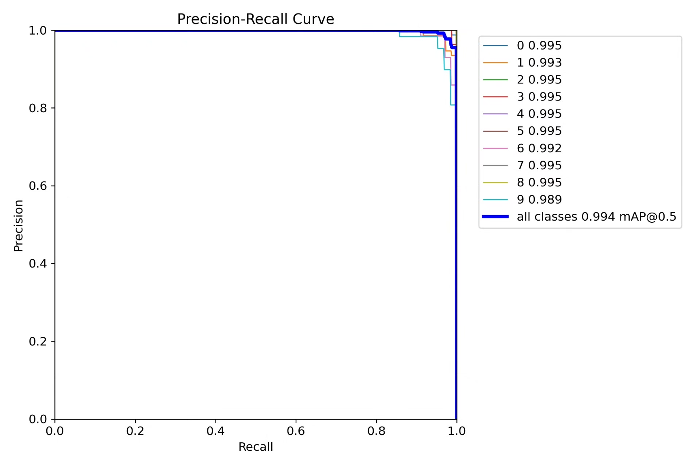
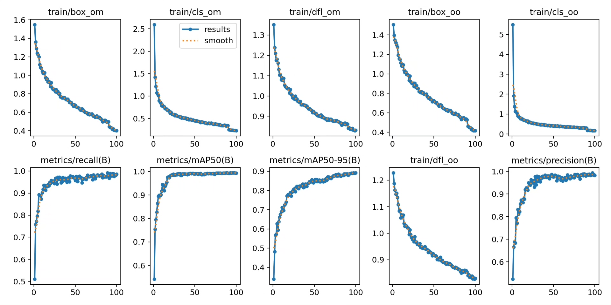
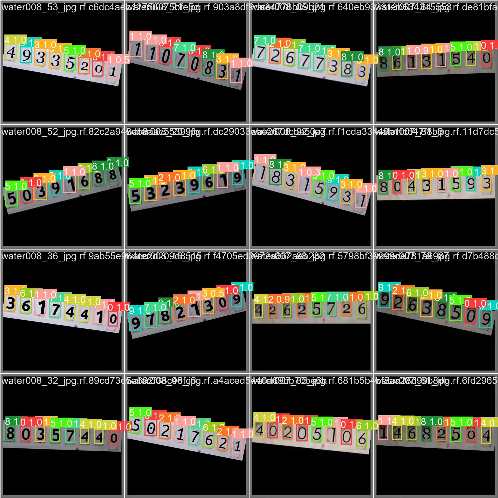
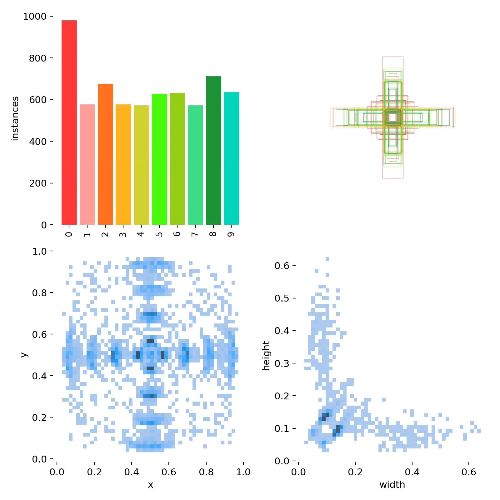
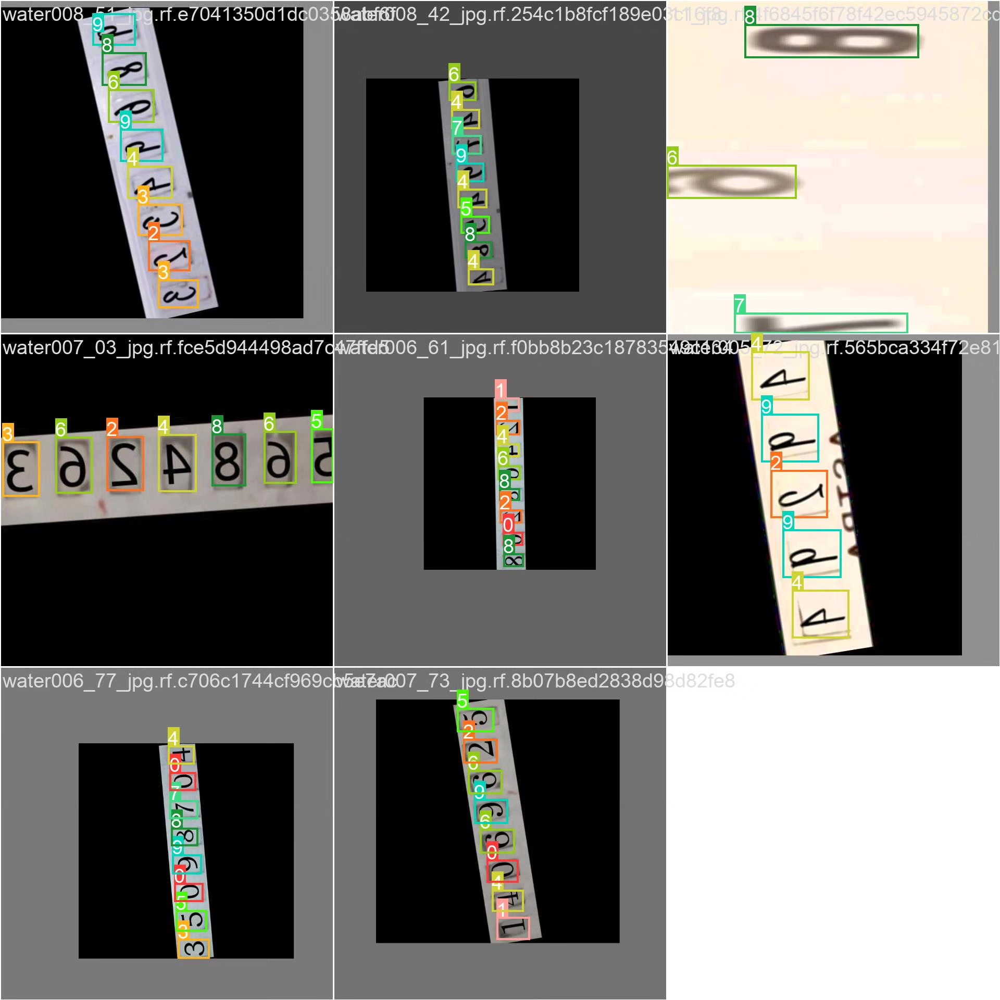

# YOLOv10-based deep learning digital recognition detection system

## Body

This is a deep learning-based digital recognition detection system based on YOLOv10. It includes the YOLOv10 dataset, UI interface, Python project source code, and model.

The project aims to use the YOLOv10 object detection algorithm to build a high-efficiency and accurate digital recognition system. The system can detect digits (0-9) in images or videos in real time and output the detection results. Through training and optimizing the model, the system can accurately recognize digits in complex backgrounds, meeting the practical needs of applications.

The company's products have obtained the official commercial license certification from YOLO.

After-sales service

After the payment is successful, we will provide a WeChat account number, and you can ask questions anytime.

Environment Configuration: A tutorial on environment configuration will be provided, and WeChat will provide Q&A.

Remote Installation Service: If you need to remotely configure the environment, an additional fee of 69 is required.
Configuration unsuccessful, all fees are refunded (specially for older computers, only installation fees are refunded).

Retrain the dataset: After setting up the environment, you can train on your own computer.
If you need us to train it for you, just pay 69 plus the computing power fee (2.5 yuan per hour).

Full package of after-sales service

## Images

## Payment

Here is a pay link on Stripe ( https://buy.stripe.com/3cs8yP7sY87d0vu9AB ). Please contact me lonlonago@foxmail.com after funding $89, and I will send you a complete data files , thank you!

